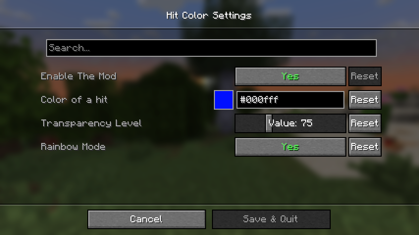
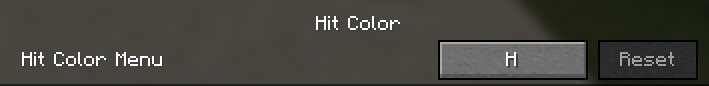

# Hit Color

```yml
How to use?
- Install the mod from modrinth/github.
- Install cloth config.
- Press the keybind H on your keyboard to open the GUI.
- Turn on/off the settings as you want.
```
## Showcase:
----------
### Settings page

----------
### Setting The Keybind

--------------------
### In Game Example (with rainbow mode enabled):

-----------------

**BE AWARE THAT YOU MUST TO DOWNLOAD [**CLOTH-CONFIG**](https://modrinth.com/mod/cloth-config) IN ORDER TO THE MOD TO WORK!**

------------------
**tysm for using this mod** 🙏
